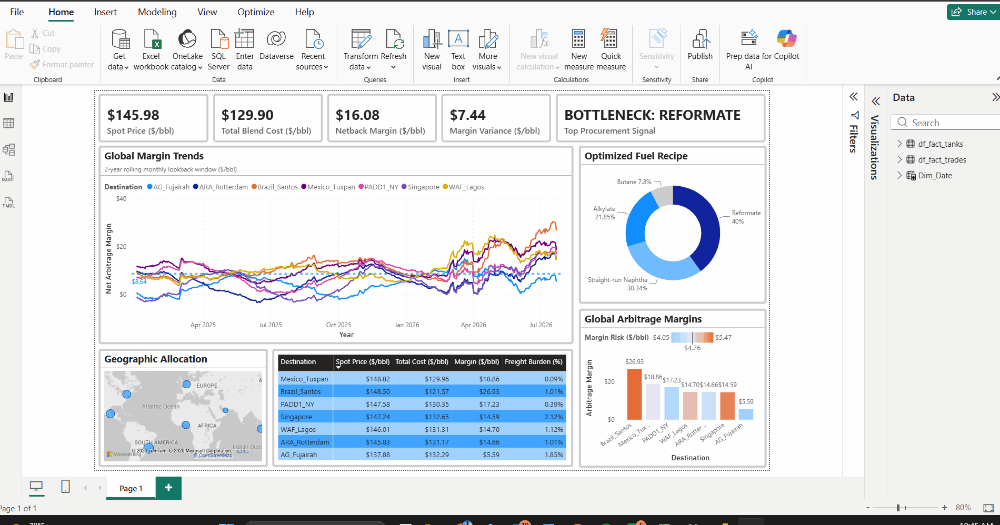

# End-to-End Refinery Optimization & Digital Twin Engine

This repository contains a production-grade refinery digital twin and quantitative trading engine that bridges deep chemical process engineering with commercial downstream analytics. 

By interfacing a headless DWSIM chemical process simulation with a SciPy Linear Programming (LP) engine and an automated Power BI analytics pipeline, this project models the end-to-end workflow of an Economic Planning & Optimization desk at a downstream energy supermajor.

---

## 📊 Live Dashboard Demonstration
*(Watch the dynamic cost allocation, tank bottleneck tracking, and risk heatmapping in action below)*



📄 **[Click here to view or download the high-resolution PDF export](assets/dashboard_Export.pdf)**

---

## System Architecture & Workflow

The engine executes an automated, four-stage data architecture to convert raw thermodynamic properties into real-world maritime arbitrage signals and operational tank bottleneck alerts:

[1. Market Ingestion] ---> [2. DWSIM Digital Twin] ---> [3. SciPy LP Engine] ---> [4. Power BI Dashboard]\
  Live WTI/RBOB Data &nbsp; &nbsp;&nbsp; &nbsp; &nbsp; Thermodynamic States &nbsp;&nbsp;&nbsp;&nbsp;&nbsp;&nbsp;&nbsp;Non-Linear Blending &nbsp;&nbsp;&nbsp;&nbsp;&nbsp;&nbsp;&nbsp;&nbsp;&nbsp;CIF Margin Heatmaps\
  &nbsp;via yfinance (Daily) &nbsp;&nbsp;&nbsp;&nbsp;&nbsp;&nbsp;&nbsp;&nbsp;&nbsp;&nbsp; (RVP / RON Extraction) &nbsp;&nbsp;&nbsp;&nbsp;&nbsp; & Cosine RVP Waves &nbsp;&nbsp;&nbsp;&nbsp;&nbsp;&nbsp;&nbsp;&nbsp;&nbsp; DAX Volatility Models\
&nbsp;&nbsp;&nbsp;&nbsp;&nbsp;&nbsp;&nbsp;&nbsp;&nbsp;&nbsp;&nbsp;&nbsp;&nbsp;&nbsp;&nbsp;&nbsp;&nbsp;&nbsp;&nbsp;&nbsp;&nbsp;&nbsp;&nbsp;&nbsp;&nbsp;&nbsp;&nbsp;&nbsp;&nbsp;&nbsp;&nbsp;&nbsp;&nbsp;&nbsp;&nbsp;&nbsp;&nbsp;&nbsp;&nbsp;&nbsp;&nbsp;&nbsp;&nbsp;&nbsp;&nbsp;&nbsp;&nbsp;&nbsp;&nbsp;&nbsp;&nbsp;&nbsp;&nbsp;&nbsp;&nbsp;&nbsp;&nbsp;&nbsp;&nbsp;&nbsp;&nbsp;&nbsp;&nbsp;&nbsp;&nbsp;&nbsp;&nbsp;&nbsp;&nbsp;&nbsp;&nbsp;&nbsp;&nbsp;&nbsp;&nbsp;&nbsp;&nbsp;&nbsp;&nbsp;&nbsp;&nbsp;&nbsp;&nbsp;&nbsp;&nbsp;&nbsp;&nbsp; & Bottleneck Alerts &nbsp;&nbsp;&nbsp;&nbsp;&nbsp;&nbsp;&nbsp;&nbsp;&nbsp;&nbsp;&nbsp;&nbsp;& Constraint Signals


1. **Market Ingestion (`price_fetcher.py`):** Programmatically extracts continuous daily historical commodity data for WTI Crude (`CL=F`) and RBOB Gasoline (`RB=F`) via the Yahoo Finance API, cleanly handling weekend exchange gaps using a forward-fill algorithm.
2. **Headless Process Simulation:** Automates a DWSIM refinery flowsheet in the background via a Python interface (`pythonnet`). The engine applies Peng-Robinson thermodynamics and Petroleum Assay Characterization to dynamically compute physical properties (RVP and RON) for intermediate streams.
3. **Mathematical Blending Optimization (`power_bi_optimizer.py`):** Evaluates feedstock component costs and solves a daily operational blending grid using SciPy LP to minimize the manufacturing cost of USGC Regular 87 gasoline, accounting for destination-specific RVP phase shifts and physical component inventory caps.
4. **Commercial Visualization Layer:** Feeds a robust multi-year daily dataset into Power BI, tracking localized global product netbacks, freight volatility, component blend ratios, and physical tank capacity constraints.

---

## Engineering & Mathematical Core

### 1. Non-Linear Property Linearization
Vapor pressure does not blend linearly by volume fraction. To solve this inside a deterministic Linear Program without stalling execution speeds, the engine converts raw Reid Vapor Pressure (RVP) into a linear blending index using an industry-standard power law:

$$RVP_{index} = RVP^{1.25}$$

### 2. Multi-Region Seasonal Regulatory Modeling (Phase Offset)
To account for geographical and hemispheric regulatory variations without introducing numerical discontinuities, the engine models the shifting environmental caps using a continuous sinusoidal function augmented with a regional phase angle offset ($\phi_{\text{dest}}$):

$$RVP_{max}(t, \text{dest}) = 10.8 + 3.0 \cdot \cos\left(\frac{2\pi t}{365} + \phi_{\text{dest}}\right)$$

* **Northern Hemisphere ($\phi_{\text{dest}} = 0$):** Summer mode ($t \approx 182$) tightens caps to a strict $7.8\text{ psi}$ (PADD1 NY, Rotterdam), forcing the optimizer to systematically restrict high-vapor-pressure Butane and draw heavily from Alkylate. Winter mode ($t \approx 0$) relaxes caps to $13.8\text{ psi}$.
* **Southern Hemisphere Inversion ($\phi_{\text{dest}} = \pi$):** For markets like Santos, Brazil, the phase angle offset inverts the seasonal wave. When the USGC experiences summer RVP tightening, Santos operates under winter limits ($13.8\text{ psi}$), creating counter-cyclical blending dynamics across global destination routes.

### 3. Tank Utilization & Bottleneck Detection
To provide operational decision support without the fragility of dual-matrix LP shadow prices, the engine measures direct physical storage limits for every component tank ($i$):

$$\text{Capacity Utilization \%} = \frac{\text{Used Volume}_i \text{ (bbl)}}{\text{Tank Capacity}_i \text{ (bbl)}} \times 100$$

When a component volume fraction hits $\ge 99\%$ of its maximum tank inventory in the LP solution, the pipeline flags the component as an active operational bottleneck ($I_{\text{constrained}} = 1$), triggering dynamic procurement alerts in the Power BI interface.

---

## Repository Structure

├── Blending_Model.dwxmz        # DWSIM Core process flowsheet and assay model\
├── price_fetcher.py            # Standalone automation script for daily historical data ingestion\
├── power_bi_optimizer.py       # Core loop script embedded within Power BI (DWSIM + SciPy LP)\
├── live_prices.csv             # Continuous daily market cache bypassing BI sandboxing\
└── README.md                   # Project documentation\

---

## Installation & Setup

### Prerequisites
* Python 3.10+
* DWSIM (installed locally with automation path exported)
* Power BI Desktop

### Dependencies
Install the required quantitative and interface packages:
```bash
pip install pandas numpy scipy yfinance pythonnet

---

## Running the Engine
1. Execute the daily market data extraction script to build your local pricing cache:
```bash
python price_fetcher.py
```
2. Verify that live_prices.csv has successfully generated daily time-series rows.
3. Open Power BI and ensure the directory paths inside the Python Script data source point to your local .dwxmz` and .csv files.
4. Click Refresh to run the complete simulation, optimization, and financial model back-test.


---

## Commercial Insights Identified
* **The "Spring Squeeze" Phenomenon:** The model captures historical margin compressions in March/April. During these windows, macroeconomic crude spikes frequently collide with structural transitions toward low-RVP summer fuel specs, driving optimized blend costs vertically.
* **Counter-Cyclical Arbitrage (Phase Offsets):** Inverting the RVP limit wave for Southern Hemisphere destinations ($\phi_{\text{dest}} = \pi$) reveals unique seasonal trade windows. During North American summer spec tightenings, exports to Brazil allow refineries to offload excess high-RVP Butane streams that are legally prohibited in USGC blends.
* **Operational Capacity Bottlenecks:** Real-time tank utilization analytics automatically highlight operational constraints (e.g., Reformate tank capacity limits at 100%), signaling the exact point where physical asset constraints limit octane blending and reduce gross margin potential.
* **Logistics & Risk Modeling:** Paired Free-on-Board (FOB) refinery costs with variable maritime freight burdens to output true Cost, Insurance, and Freight (CIF) margins, utilizing statistical iterators (STDEVX.S) in DAX to evaluate destination margin volatility.


